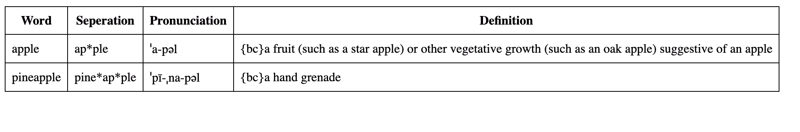

# WordGen
Generate a word list with meaning and pronunciation using Rust Wasm.
I write this to correct my pronunciation problems while memorizing words.

The input format should be a word list separated by commas. I decided to use this format as I could easily 
import the new words from my kindle vocabulary builder.

Output:
